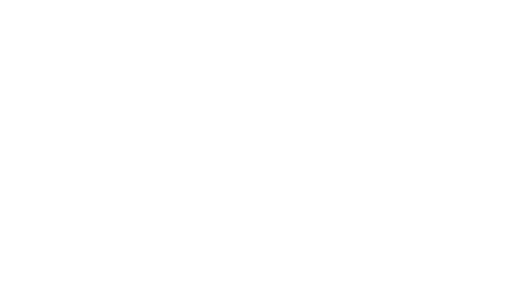
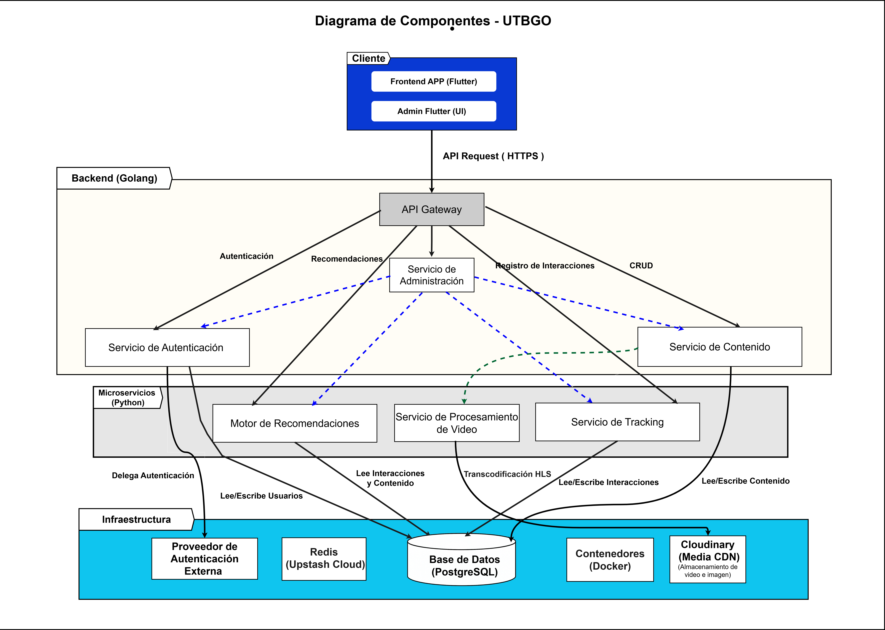

<div align="center">
  
  <h1>🚀 UTBGO</h1>
  <p><strong>Plataforma Universitaria de Aprendizaje en formato Micro-Learning</strong></p>

  [](https://flutter.dev/)
  [](https://golang.org/)
  [](https://www.python.org/)
  [](https://www.postgresql.org/)
  [](https://redis.io/)
  [](https://www.docker.com/)
</div>

---

## 📖 Sobre el Proyecto

**UTBGO** es una aplicación móvil multiplataforma diseñada para transformar la manera en que los estudiantes consumen y comparten conocimiento. A través de un formato de videos cortos interactivos (estilo TikTok/Reels), UTBGO combina el entretenimiento con el aprendizaje académico.

La plataforma cuenta con un potente ecosistema de microservicios que incluye recomendaciones personalizadas basadas en Inteligencia Artificial y transcodificación de video de alto rendimiento.

## 🏗️ Arquitectura del Sistema

El proyecto está diseñado bajo una arquitectura de microservicios moderna y escalable, dividida en 5 componentes principales:

1. 📱 **Frontend (Flutter):** Aplicación móvil nativa fluida con soporte para iOS y Android. Incluye también un panel de administración integrado.
2. ⚡ **API Gateway & Core (Golang):** El corazón del backend. Escrito en Go para máxima concurrencia y velocidad. Maneja la autenticación OIDC, el CRUD de contenidos y la moderación de comentarios.
3. 📊 **Tracking Service (Python/FastAPI):** Microservicio dedicado a la ingesta masiva de interacciones de los usuarios (vistas, likes, tiempo de visualización) en tiempo real.
4. 🧠 **Recommendation Engine (Python):** Motor de Inteligencia Artificial (LightGBM) que analiza el comportamiento del usuario para generar feeds de contenido altamente personalizados.
5. 🎬 **Video Processing Worker (Python/FFmpeg):** Servicio encargado de tomar los videos subidos, comprimirlos y convertirlos a formato HLS para garantizar un streaming fluido en cualquier ancho de banda.

<div align="center">
  
</div>

## 🛠️ Stack Tecnológico

| Categoría | Tecnologías |
| :--- | :--- |
| **Mobile App** | Flutter, Dart, Firebase Auth |
| **Backend Core** | Golang, Gin Framework |
| **Microservicios** | Python, FastAPI, LightGBM, FFmpeg |
| **Bases de Datos** | PostgreSQL (Neon), Redis (Upstash Cloud) |
| **Almacenamiento** | Cloudinary (Media CDN) |
| **Infraestructura**| Docker, Docker Compose |

## 📂 Estructura del Repositorio

```text
📦 UTBGO
 ┣ 📂 api-service/             # API Principal Orquestadora (Go)
 ┣ 📂 tracking-service/        # Microservicio de Analíticas (Python)
 ┣ 📂 recommendations-service/ # Motor de IA y Recomendaciones (Python)
 ┣ 📂 video-worker-service/    # Transcodificación de Video HLS (Python)
 ┣ 📂 lib/                     # Código fuente de la App Móvil (Flutter)
 ┗ 📜 docker-compose.yml       # Orquestación de infraestructura local
```

---

## 🚀 Guía de Inicio Rápido

Para poner en marcha todo el ecosistema de UTBGO en tu entorno local en pocos minutos, sigue estos pasos:

### 1. Variables de Entorno
El proyecto utiliza servicios Cloud modernos. Debes configurar tus llaves:
1. Copia el archivo de plantilla: `cp .env.example .env`
2. Abre el archivo `.env` y coloca tus credenciales reales (Neon, Upstash, Cloudinary, Firebase).

### 2. Levantar el Ecosistema Backend
Utilizamos **Docker Compose** para orquestar la API en Go y todos los microservicios en Python sin necesidad de que instales nada localmente:

```bash
docker-compose up -d --build
```
> **Nota:** Esto levantará la API de Go (puerto 8080), el Tracking Service (8091), el Recommendation Service (8090) y el Worker de Video en segundo plano.

### 3. Ejecutar la Aplicación (Flutter)
1. Abre tu emulador preferido (Android o iOS) o conecta un dispositivo físico.
2. Desde la raíz del proyecto, instala las dependencias y ejecuta la app:

```bash
flutter pub get
flutter run
```

---

## 🛡️ Seguridad y Moderación

UTBGO incluye herramientas avanzadas para la convivencia digital:
- **Autenticación Segura:** Manejo de sesiones con JWT y validación externa vía Firebase (Google SignIn).
- **Panel Administrativo:** Interfaz secreta dentro de la app para moderadores.
- **Reporte y Moderación:** Sistema de denuncias con borrado en cascada protegido en base de datos e invalidación instantánea de caché.

